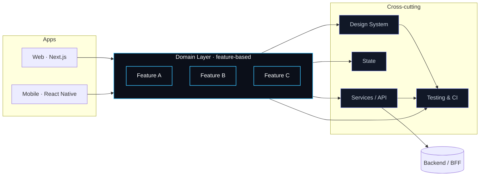

<!--
  Alex Guerrero — GitHub Profile
  Frontend / Mobile Architect · React · React Native · TypeScript
  Available for consulting · Santa Marta, CO (UTC-5)
-->

  

  
  
  
  

  <a href="https://www.linkedin.com/in/alexjrguerrero">LinkedIn</a> ·
  <a href="mailto:guerreroalexjr@gmail.com">Email</a> ·
  <a href="https://github.com/GuerreroAlexjr9/react-architecture-playground">Flagship repo</a>

  
  

---

## Sobre mí

Diseño y evoluciono aplicaciones **web y móviles enterprise** en **React**, **React Native** y **TypeScript**.
Mi trabajo se concentra en **arquitectura modular**, **migraciones incrementales** desde bases legacy y **design systems** que sostienen el ritmo de equipos grandes.

Vengo de entornos donde compatibilidad, performance y trazabilidad **no son negociables**, y donde el delivery no puede frenarse para refactorizar. Mi enfoque es ese intermedio: **modernizar sin romper**.

---

## Consultoría

> **Disponible para engagements remotos** — equipos producto, plataformas internas y modernización de stacks frontend/mobile.

| Engagement | Cuándo aplica |
|---|---|
| **Architecture audit** | Tu app crece más rápido que su estructura: bordes difusos, regresiones constantes, equipos que se pisan. |
| **Migration roadmap** | Necesitas pasar de legacy (CRA, AngularJS, Webpack viejo, RN clásico) a un stack moderno sin congelar features. |
| **Design system bootstrap** | Quieres consistencia visual y de comportamiento entre productos sin reinventar componentes en cada squad. |
| **Hands-on advisory** | Tu equipo necesita un arquitecto embebido part-time para guardrails, code review y decisiones técnicas. |

➜ **[guerreroalexjr@gmail.com](mailto:guerreroalexjr@gmail.com?subject=Consulting%20inquiry)** · respuesta en 48h.

---

## Cómo aporto valor

- **Arquitectura por dominios** — feature-based boundaries, project references de TypeScript y reglas de ESLint que evitan acoplamientos antes del PR.
- **Migraciones controladas** — strangler pattern, feature flags y métricas para reemplazar legacy sin congelar el roadmap del producto.
- **Design systems componibles** — tokens, primitives y componentes accesibles (WAI-ARIA) listos para web y móvil, con governance clara.
- **Testing como contrato** — pirámide pragmática (unit + integration + e2e crítico) y CI con budgets que bloquean regresiones, no que decoran.
- **Performance medible** — Core Web Vitals y startup móvil con presupuestos versionados, no “sentir que va más rápido”.

---

## Stack

| Capa | Tecnologías |
|---|---|
| **Core** | React · React Native · TypeScript · Next.js |
| **Arquitectura** | Feature-based modules · Monorepo (pnpm/turbo) · Design Systems |
| **Calidad** | Vitest · Jest · Testing Library · Playwright · ESLint · TS project refs |
| **Estado & Datos** | Zustand · Redux Toolkit · React Query · GraphQL · REST |
| **Plataforma** | GitHub Actions · AWS · Firebase · Vercel |

  
  
  
  

---

## Proyectos insignia

### [`react-architecture-playground`](https://github.com/GuerreroAlexjr9/react-architecture-playground)
Referencia ejecutable de arquitectura escalable en React: feature-based modules, route guards, capa de estado, testing y CI listos para producción.
**Docs:** [`/docs/spec.md`](https://github.com/GuerreroAlexjr9/react-architecture-playground/blob/main/docs/spec.md) · [`/docs/architecture.md`](https://github.com/GuerreroAlexjr9/react-architecture-playground/blob/main/docs/architecture.md) · [`/docs/decisions.md`](https://github.com/GuerreroAlexjr9/react-architecture-playground/blob/main/docs/decisions.md)

### Próximos
- **`react-native-architecture-playground`** — equivalente móvil con navegación, módulos nativos y CI multi-plataforma.
- **`design-system-starter`** — base mínima viable para un DS multi-producto (tokens, primitives, governance).

---

## Mindset de arquitectura

**Principios que aplico:**
1. Las **features no se conocen entre sí**; comparten contratos, no implementaciones.
2. El **design system** es la única fuente de UI; nada de variantes ad-hoc por squad.
3. Los **servicios** son una capa fina sobre la red; la lógica de negocio vive en el dominio.
4. **Testing** acompaña la arquitectura, no la persigue.
5. Toda decisión relevante queda en un **ADR** versionado.

---

## Métricas

  

  
  

Generado automáticamente con <a href="https://github.com/lowlighter/metrics">lowlighter/metrics</a> · refresco diario.

---

<strong>🇬🇧 Read in English</strong>

### About

I design and evolve **enterprise web and mobile apps** in **React**, **React Native** and **TypeScript**. My focus is **modular architecture**, **incremental migrations** out of legacy stacks, and **design systems** that scale across multiple teams.

I work in environments where compatibility, performance and traceability are non-negotiable, and where delivery can’t freeze for a rewrite. My job sits exactly there: **modernize without breaking**.

### Consulting

Available for **remote engagements** — product teams, internal platforms and frontend/mobile modernization.

| Engagement | When it fits |
|---|---|
| **Architecture audit** | The codebase outgrew its structure: blurry boundaries, recurring regressions, teams stepping on each other. |
| **Migration roadmap** | You need to move off legacy (CRA, AngularJS, old Webpack, classic RN) without freezing features. |
| **Design system bootstrap** | You want visual and behavioral consistency across products without re-inventing components per squad. |
| **Hands-on advisory** | Your team needs a part-time embedded architect for guardrails, reviews and technical decisions. |

➜ **[guerreroalexjr@gmail.com](mailto:guerreroalexjr@gmail.com?subject=Consulting%20inquiry)** · reply within 48h.

### How I add value

- **Domain-driven frontend** — feature-based boundaries, TS project references and ESLint rules that prevent coupling before the PR.
- **Controlled migrations** — strangler pattern, feature flags and metrics to replace legacy without freezing the roadmap.
- **Composable design systems** — tokens, primitives and accessible components (WAI-ARIA) for web and mobile, with clear governance.
- **Testing as a contract** — pragmatic pyramid (unit + integration + critical e2e) and CI budgets that block regressions instead of decorating.
- **Measurable performance** — Core Web Vitals and mobile startup with versioned budgets, not “feels faster”.

---

  <strong>¿Necesitas modernizar un frontend, migrar una app legacy o escalar un design system?</strong> 
  Need to modernize a frontend, migrate a legacy app or scale a design system?

  
  

